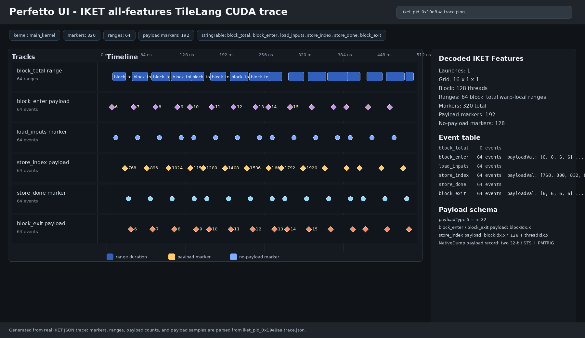

# IKET Profiling for the TileLang CUDA Backend

This page documents the experimental `T.iket` frontend hooks for profiling
TileLang CUDA kernels with IKET. The implementation is intentionally scoped to
the regular TileLang CUDA backend. It does not depend on TileScale or on the
CuTe DSL frontend, although it consumes the same external IKET runtime and trace
viewer format.

## What Is Supported

The current TileLang integration supports:

- Kernel timeline markers through `T.iket.mark(...)`.
- Warp-local ranges through `T.iket.range(...)`, `T.iket.range_push(...)`, and
  `T.iket.range_pop(...)`.
- Runtime scalar payload capture through `T.iket.payload(...)`.
- A process-local output directory through `T.iket.session(output_dir=...)`.
- Helper APIs for trace discovery and IKET CLI command construction.
- Perfetto-compatible `.pftrace`, `.pftrace.gz`, `.trace.json`, and `.html`
  exports through the external IKET CLI.

The currently supported runtime payload dtypes are:

- `int32`
- `uint32`
- `float32`

Other IKET payload kinds may exist in the external IKET metadata format, but
TileLang only emits 32-bit runtime payload records today.

Source-code location correlation is not supported by this TileLang integration.
Trace `locIdx` values are IKET runtime location indices, not Python or TIR source
line references.

## Requirements

Run the examples from an environment that has TileLang, CUDA, PyTorch, and the
external IKET Python package available. In the local development setup used by
these examples, that environment is named `tl`:

```bash
conda run -n tl python -c "import tilelang, iket, torch"
```

The IKET profiler is launched through:

```bash
python -m iket.cli.main
```

The profiler injects the external IKET runtime with CUDA injection variables.
You usually do not need to set those variables manually when using
`iket.cli.main profile`.

## Basic Usage

Use `T.iket.session(...)` around the TileLang compile step. The session resets
the local event registry, enables the CUDA post-processing hook, optionally sets
the output directory, and restores the previous state on exit.

```python
import tilelang
import tilelang.language as T


def kernel_with_markers(n: int, threads: int = 128, dtype=T.float32):
    @T.prim_func
    def main(A: T.Tensor((n,), dtype), C: T.Tensor((n,), dtype)):
        with T.Kernel(T.ceildiv(n, threads), threads=threads) as bx:
            with T.iket.range("block_total"):
                T.iket.mark("block_enter", payload=T.iket.payload(bx, dtype="int32"))
                for i in T.Parallel(threads):
                    idx = bx * threads + i
                    if idx < n:
                        T.iket.mark("load_inputs")
                        value = A[idx] + 1.0
                        T.iket.mark("store_index", payload=T.iket.payload(idx, dtype="int32"))
                        C[idx] = value
                        T.iket.mark("store_done")
                T.iket.mark("block_exit", payload=T.iket.payload(bx, dtype="int32"))

    return main


with T.iket.session(
    output_dir="/tmp/tilelang_iket_example",
    runtime_payloads=True,
):
    program = kernel_with_markers(2048)
    kernel = tilelang.compile(
        program,
        out_idx=-1,
        target="cuda",
        execution_backend="cython",
    )
```

Important details:

- `runtime_payloads=True` is required if the trace should contain real payload
  values. Without it, payload APIs still register schema information locally, but
  emitted IKET metadata keeps payload type `NoPayload`.
- `T.iket.payload(expr, dtype=...)` must be passed to `payload=`. Passing raw
  values is allowed only for simple inferred dtypes.
- Ranges are warp-local in the IKET trace. A block with four warps can produce
  four range instances for one lexical `T.iket.range(...)`.

## Running the Included Examples

The example directory is organized as:

```text
examples/iket/
  README.md
  minimal.py
  payload_minimal.py
  all_features.py
  assets/
    iket_perfetto_all_features.png
```

Minimal marker example:

```bash
conda run -n tl python examples/iket/minimal.py \
  --iket-output-dir /tmp/tilelang_iket_minimal
```

Minimal runtime payload example:

```bash
conda run -n tl python examples/iket/payload_minimal.py \
  --iket-output-dir /tmp/tilelang_iket_payload_minimal \
  --iket-runtime-payloads
```

Comprehensive example with ranges, no-payload markers, and runtime payload
markers:

```bash
conda run -n tl python examples/iket/all_features.py \
  --iket-output-dir /tmp/tilelang_iket_all_features \
  --iket-runtime-payloads
```

Those commands compile and run the kernels directly. To collect a trace, wrap the
target command with the IKET profiler:

```bash
rm -rf /tmp/tilelang_iket_all_features_profile

conda run -n tl python -m iket.cli.main \
  --output-dir /tmp/tilelang_iket_all_features_profile \
  --clobber \
  profile \
  --postprocess all \
  -- \
  conda run -n tl python examples/iket/all_features.py \
    --iket-output-dir /tmp/tilelang_iket_all_features_profile \
    --iket-runtime-payloads
```

The profiler writes files like:

```text
iket_pid_0x....pftrace
iket_pid_0x....pftrace.gz
iket_pid_0x....trace.json
iket_pid_0x....html
```

## Visualizing a Trace

Serve the output directory with a local HTTP server:

```bash
cd /tmp/tilelang_iket_all_features_profile
python3 -m http.server 8080
```

Then open the generated HTML file:

```text
http://localhost:8080/iket_pid_0x....html
```

On a remote machine, forward the port to your local workstation:

```bash
ssh -L 8080:localhost:8080 user@remote-host
```

Start the HTTP server on the remote host and open the same localhost URL in your
local browser.

If the page shows only the Perfetto landing page, load the `.pftrace` file from
the same output directory in the Perfetto UI, or open the exact generated
`iket_pid_0x....html` file served from the directory that also contains the
matching `.pftrace`.

## Trace Screenshot

The screenshot below is captured from the real Perfetto Timeline after loading
the all-features IKET trace. The `IKET events` track visualizes decoded TileLang
range slices, no-payload markers, and runtime payload markers from the same
kernel launch.

<p align="center">
  
</p>

## Inspecting Payloads Programmatically

The JSON trace is useful for checking whether payload values were captured:

```python
import collections
import json
from pathlib import Path

trace_path = max(
    Path("/tmp/tilelang_iket_all_features_profile").glob("*.trace.json"),
    key=lambda path: path.stat().st_size,
)

data = json.loads(trace_path.read_text())
launch = data["launches"][0]
names = data["stringTable"]
markers = launch["markers"]

print(collections.Counter(names[m["markerNameIdx"]] for m in markers))

store_index_values = [
    m["payloadVal"]
    for m in markers
    if names[m["markerNameIdx"]] == "store_index" and "payloadVal" in m
]
print(store_index_values[:8])
```

A successful all-features run should contain:

- `block_total` in `stringTable`.
- `block_enter`, `load_inputs`, `store_index`, `store_done`, and `block_exit`
  markers.
- Range entries for `block_total`.
- `payloadType` and `payloadVal` on payload-enabled markers.

## API Reference

### `T.iket.session(...)`

```python
with T.iket.session(
    reset_events=True,
    override=True,
    disable_on_exit=True,
    output_dir=None,
    runtime_payloads=None,
):
    ...
```

Parameters:

- `reset_events`: clear the process-local event table before compiling.
- `override`: replace the existing CUDA post-processing callback.
- `disable_on_exit`: restore the previous callback when leaving the session.
- `output_dir`: set `TL_IKET_OUTPUT_DIR` and create the directory.
- `runtime_payloads`: enable or disable runtime payload metadata for this
  session. `None` preserves the previous global setting.

### `T.iket.mark(name, payload=None)`

Emits an instant marker. The name is registered once per compile session and
mapped to an IKET event id.

```python
T.iket.mark("load_inputs")
T.iket.mark("store_index", payload=T.iket.payload(idx, dtype="int32"))
```

### `T.iket.range(name, payload=None)`

Python context manager that emits `range_push` on entry and `range_pop` on exit.

```python
with T.iket.range("block_total"):
    ...
```

`range_push` can carry a payload, but `range_pop` uses IKET's reserved range-end
event and does not carry a user payload in the TileLang implementation.

### `T.iket.payload(expr, dtype=None)`

Creates a payload descriptor for a scalar expression.

```python
T.iket.payload(idx, dtype="int32")
T.iket.payload(flag, dtype="uint32")
T.iket.payload(value, dtype="float32")
```

Use an explicit dtype for TileLang expressions. Inference is only intended for
simple Python scalar values and expressions that expose a `dtype` attribute.

### Output Helpers

```python
T.iket.set_output_dir("/tmp/iket")
T.iket.output_dir()
T.iket.output_path("kernel.cu")
T.iket.trace_files()
T.iket.profile_command([...], directory="/tmp/iket")
```

These helpers are host-side conveniences. They do not run the IKET profiler by
themselves.

## Implementation Overview

The integration has three layers.

### 1. Frontend Event Registry

`tilelang/language/iket.py` keeps a process-local registry of events and ranges.
Each `mark` or `range_push` call records:

- event name
- event id
- event kind (`mark` or `range`)
- range id for ranges
- payload dtype schema
- IKET payload type id

The frontend call returns a TIR extern call such as:

```python
tirx.call_extern("handle", "TL_IKET_EVENT", event_id)
tirx.call_extern("handle", "TL_IKET_EVENT_PAYLOAD_U32", event_id, payload_expr)
```

TileLang's normal CUDA code generator lowers those extern calls into CUDA macro
invocations.

### 2. CUDA Post-Processing

`T.iket.enable()` registers a `tilelang_callback_cuda_postproc` callback. The
callback injects two things into the generated CUDA source:

- IKET metadata arrays with `__device__ __attribute__((used, aligned(1)))`.
- Inline PTX macros that write event records to IKET's shared-memory dump area
  and trigger `pmevent.mask`.

The metadata arrays are intentionally small and binary-compatible with the
external IKET runtime's expected event attributes. The current event attribute
layout includes:

- event id
- instrumentation method `3`, which is IKET NativeDump
- payload type id
- range flags and range id for range-start events
- event name bytes

IKET reserves event id `31` for range pop. TileLang skips that id when assigning
user events.

### 3. NativeDump Event Records

No-payload events use the original 4-byte NativeDump record:

```text
shared[base + 0x20] = globaltimer_lo | event_id
pmevent.mask event_id
```

Runtime payload events use an 8-byte logical record:

```text
shared[base + 0x20] = globaltimer_lo | event_id
shared[base + 0x24] = payload_value
pmevent.mask event_id
```

The two 32-bit stores must remain separate in SASS. If ptxas fuses them into a
single `STS.64`, the current external IKET runtime can crash in
`IketKernelPatchRecipe::patchKernel` while patching payload events. TileLang
prevents that fusion by emitting the payload value store as a volatile 32-bit
shared-memory store. The expected SASS shape is:

```text
STS [addr], timestamp_with_event_id
STS [addr+0x4], payload_value
PMTRIG event_id
```

No-payload events keep the 4-byte record. Mixing 4-byte no-payload records and
8-byte payload records is required because the IKET decoder uses the payload type
declared in metadata to decode each event.

## Known Limitations

- Only CUDA backend profiling is supported.
- Only 32-bit runtime payloads are emitted by TileLang today.
- Runtime payload metadata is opt-in through `runtime_payloads=True`.
- Source-code location tables are not generated by this integration.
- The implementation depends on the external IKET runtime's private metadata and
  NativeDump conventions, so it should be treated as experimental.
- IKET records events at warp granularity. Payload values often correspond to
  the lane selected by IKET's dump mechanism, not every individual thread.

## Troubleshooting

### The HTML page shows only the Perfetto home page

Serve the generated output directory and open the exact generated HTML file. The
HTML expects the matching `.pftrace` file to be available next to it.

```bash
cd /tmp/tilelang_iket_all_features_profile
python3 -m http.server 8080
```

Then open:

```text
http://localhost:8080/iket_pid_0x....html
```

If that still does not load the trace, open Perfetto manually and import the
`.pftrace` file from the same directory.

### The trace has payload schemas but no `payloadVal`

Make sure the kernel was compiled inside:

```python
with T.iket.session(runtime_payloads=True):
    ...
```

Also make sure the event uses:

```python
T.iket.mark("name", payload=T.iket.payload(expr, dtype="int32"))
```

### The profiler crashes in `patchKernel`

Check the generated SASS. Payload events must not use `STS.64` for the timestamp
and payload pair.

```bash
nvdisasm kernel.cubin | grep -E "STS|PMTRIG"
```

Expected payload shape:

```text
STS [addr], timestamp_with_event_id
STS [addr+0x4], payload_value
PMTRIG event_id
```

If `STS.64` appears for payload records, the inline PTX was changed in a way that
lets ptxas fuse the two stores again.
